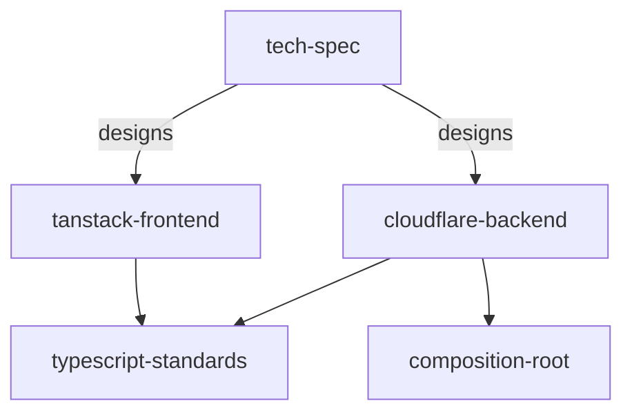

# Agent Skills

[](https://agentskills.io)
[](LICENSE)

**Software architecture for coding agents: DDD, CQRS, hexagonal design, and Feature-Sliced frontends, packaged as skills.**

> **Why I made these**
>
> I build products on my own, and coding agents write most of my code. Out of the box, that code is bad. It runs, but it puts business rules in route handlers, turns every failure into a string, retries a payment without an idempotency key, and invents a new data layer for each feature. A month later, every change fights the codebase.
>
> I stopped waiting for the next model to fix this. These skills are the rules I enforce in code review, written so the agent follows them before I have to ask. They do not make the agent perfect. They make it write much less code that I have to throw away.
>
> — [Alexander Zuev](https://github.com/alexander-zuev)

```bash
npx skills add alexander-zuev/agent-skills
```

They follow the [Agent Skills](https://agentskills.io) format and work in Claude Code, Codex, Cursor, and any agent that supports skills.

## Patterns inside

| Area | Patterns |
| --- | --- |
| Domain | Domain-Driven Design: entities, aggregates, value objects, domain services · Tagged-union state machines · Branded types · Parse, don't validate |
| Application | CQRS with commands, events, and queries · Message bus with a compiler-checked registry · Unit of Work · Transactional outbox · Idempotent handlers |
| Architecture | Hexagonal architecture (ports and adapters) · Clean dependency direction · Composition root and dependency injection · Functional core, imperative shell · Deep modules |
| Persistence | Repository pattern with a closed method list · Optimistic concurrency · Atomic upserts · Expand-and-contract migrations |
| Errors | Typed, tagged failures · One logging boundary · Transport error conversion · Result types only where they earn their place |
| Frontend | Feature-Sliced Design · Modular React with Fowler's presentation model · Query and mutation factories · Router and Query cache ownership |
| Contracts | Published-contract versioning with overlap and deprecation · Cursor pagination · Rate limits on every public surface |
| Process | Typed tech specs with call stacks · Red-green test plans · Tests through real seams, no module mocks |

Effect codebases are supported: services act as ports, layers as adapters, and effects run only at the entrypoint.

## Skills

### `typescript-standards`

The base layer. How to model a domain and design modules in TypeScript.

- Domain, application service, and adapter roles, each with one reason to change.
- Narrow ports owned by the application; wide adapters that satisfy them structurally.
- Illegal states made unrepresentable with branded types and tagged unions.
- Failure design for every operation: what fails, who converts it, who logs it, who retries.

### `cloudflare-backend`

DDD and CQRS on Cloudflare Workers.

- Every entrypoint has one job: parse, authorize, dispatch, respond.
- Commands run in a unit of work that claims a receipt, writes state, and stores events in an outbox in one transaction.
- Events fan out to state and effect subscribers with different idempotency rules.
- Platform rules for D1, Postgres through Hyperdrive, Queues, Workflows, Durable Objects, and KV.

### `tanstack-frontend`

Frontends that stay modular as they grow.

- Feature-Sliced Design layers with one-way imports.
- Fowler's layers: thin components, hooks that own the presentation model, framework-free domain models, and a separate data layer.
- Query and mutation factories as the only path to server state, with stable keys and awaited invalidation.
- Consistent loading, error, and pending states across the app.

### `composition-root`

Dependency injection without a framework.

- One composition root builds the dependency graph for each invocation.
- Binding adapters implement ports; inner code never sees `Env` or a binding name.
- A step-by-step refactor that moves raw platform access outward one layer at a time.

### `tech-spec`

Architecture before implementation.

- Alternatives compared against invariants and constraints, with one recommendation.
- Typed contracts, call stacks, and data flow for each operation.
- A file map and a red-green test plan that another agent can execute.

### `product-research`

Evidence before you build.

- Real pain points from Reddit communities.
- Validation against existing tools, competitor reviews, and market signals.
- A scored, ranked list of ideas with links to the evidence.

## How the skills work together



Agents load a skill when the task matches it. A backend task loads `cloudflare-backend`; it defers to `typescript-standards` for types, errors, and module design.

## Install

<details open>
<summary><strong>Any agent (skills CLI)</strong></summary>

```bash
npx skills add alexander-zuev/agent-skills
```

Add `-s <skill>` for one skill, `-g` for every project, or `-a <agent>` for one agent. The [skills CLI](https://skills.sh) supports Claude Code, Codex, Cursor, OpenCode, and more. Update with `npx skills update`.

</details>

<details>
<summary><strong>Claude Code plugin</strong></summary>

```text
/plugin marketplace add alexander-zuev/agent-skills
/plugin install agent-skills@agent-skills
```

</details>

<details>
<summary><strong>claude.ai</strong></summary>

Download a skill zip from the [latest release](https://github.com/alexander-zuev/agent-skills/releases/tag/latest), then upload it in **Settings → Capabilities → Skills**.

</details>

<details>
<summary><strong>Cloud agents and bots</strong></summary>

Add the skills CLI to the environment setup script:

```bash
npx skills add alexander-zuev/agent-skills -g -y
```

An agent that can only fetch a URL reads each skill directly:

```text
https://raw.githubusercontent.com/alexander-zuev/agent-skills/main/skills/<skill>/SKILL.md
```

</details>

## Stack

The design patterns apply to any TypeScript codebase. The platform rules target TypeScript, React, TanStack Start, Router, and Query, Cloudflare Workers, D1, Postgres through Hyperdrive, Queues, Workflows, Durable Objects, and Zod.

## Feedback

Found a gap or a rule you disagree with? Open an [issue](https://github.com/alexander-zuev/agent-skills/issues).

## License

[Apache-2.0](LICENSE)
