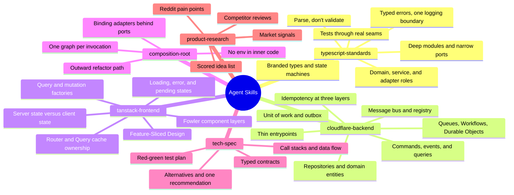

# Agent Skills

[](https://agentskills.io)
[](LICENSE)

**Software architecture for coding agents: DDD, CQRS, hexagonal design, and Feature-Sliced frontends, packaged as skills.**

> **Why I made these**
>
> Coding agents write most of my code. Out of the box, it puts business rules in route handlers, turns failures into strings, and retries payments without an idempotency key. These skills are the rules I enforce in code review, written so the agent follows them before I have to ask.

```bash
npx skills add alexander-zuev/agent-skills
```

Works in Claude Code, Codex, Cursor, and any agent that supports the [Agent Skills](https://agentskills.io) format.

## Skills

| Skill | Use it for |
| --- | --- |
| [`typescript-standards`](skills/typescript-standards/SKILL.md) | Domain modeling, module design, typed errors, and tests in any TypeScript |
| [`cloudflare-backend`](skills/cloudflare-backend/SKILL.md) | DDD and CQRS backends on Cloudflare Workers |
| [`tanstack-frontend`](skills/tanstack-frontend/SKILL.md) | React and TanStack Start frontends with Feature-Sliced Design |
| [`composition-root`](skills/composition-root/SKILL.md) | Dependency injection for Cloudflare bindings |
| [`tech-spec`](skills/tech-spec/SKILL.md) | A typed architecture spec before code |
| [`product-research`](skills/product-research/SKILL.md) | Validating product ideas with evidence |



Also inside: expand-and-contract migrations, optimistic concurrency, published-contract deprecation, cursor pagination, and Effect support.

## Install

| Where | How |
| --- | --- |
| Any agent | `npx skills add alexander-zuev/agent-skills` — add `-s <skill>`, `-g`, or `-a <agent>` |
| Claude Code plugin | `/plugin marketplace add alexander-zuev/agent-skills`, then `/plugin install agent-skills@agent-skills` |
| claude.ai | Upload a zip from the [latest release](https://github.com/alexander-zuev/agent-skills/releases/tag/latest) in **Settings → Capabilities → Skills** |
| Cloud agents | Run `npx skills add alexander-zuev/agent-skills -g -y` in the environment setup script |
| URL only | `https://raw.githubusercontent.com/alexander-zuev/agent-skills/main/skills/<skill>/SKILL.md` |

## Stack

The design rules apply to any TypeScript codebase. The platform rules target React, TanStack Start, Cloudflare Workers, D1, Postgres through Hyperdrive, and Zod.

Feedback: open an [issue](https://github.com/alexander-zuev/agent-skills/issues). License: [Apache-2.0](LICENSE).
